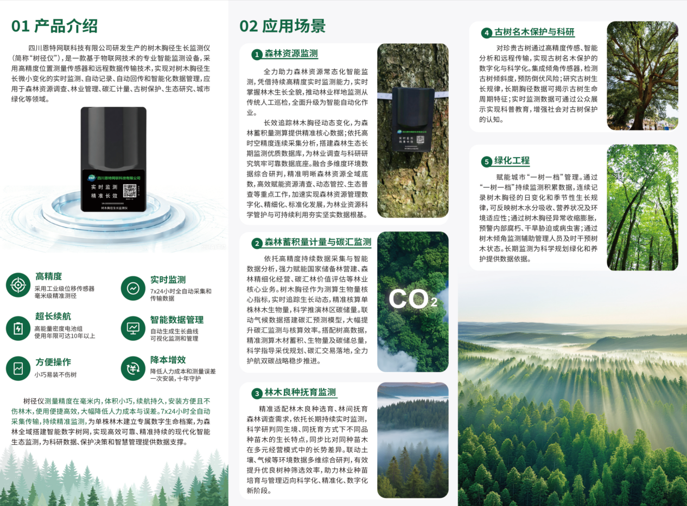

<div align="center">

# 树木胸径生长监测仪 / 树径测量仪

[](./LICENSE)
[](https://www.java.com)
[](./CHANGELOG.md)
[](./lib/)

一个面向**森林树径监测平台**的轻量级 Java SDK —— 几行代码即可完成登录、查询样地、查询样木、查询树径设备、拉取历史监测数据等操作，让你的 Java 应用快速接入林业物联网数据。

[English](#english) · [中文](#中文) · [产品介绍](#产品介绍)

</div>

---

## 产品介绍

> **树木胸径生长监测仪 —— 一次安装，守护十年**

林业外业调查是林草资源管理与生态科研的基石，但传统"皮尺 + 手写"模式长期深陷**效率低、误差大、成本高**三大困境：队员需在密林中弯腰拉尺、屈膝记录，单株测量耗时超 5 分钟；肉眼读数偏差与手写笔误，更让数据偏离度高达 **18%**，严重影响普查与监测的准确性。

**树木胸径生长监测仪**通过工业级位移传感器、7×24 自动采集、≥10 年超长续航和 30 秒无损抱箍式安装，将传统人工测量升级为"设备长期记录变化"的数字化监测体系。同等监测任务仅需 **1 人 1 天**即可完成，数据准确率稳定在 **99.9%**，彻底扭转了传统外业低效、易错、高强度的作业现状。

本仓库的 `forest-tree-net-client` SDK 正是该监测仪所属的**森林树径监测平台**官方 Java 客户端 —— 通过 SDK，你可以在自有 Java 应用中直接拉取传感器上报的样地、样木、设备、历史读数等数据。

<table>
<tr>
<td width="55%" valign="top">

### 🎯 五大核心产品特性

- 🎯 **毫米级精度** —— 采用工业级位移传感器，误差 ≤ ±1 mm
- ⏱️ **7×24 实时监测** —— 全自动周期性采集与上传
- 🔋 **≥10 年续航** —— 高能量密度电池组，一次安装长期守护
- 📡 **多通信方式** —— 支持 4G / NB-IoT / LoRa
- 📊 **智能数据管理** —— 自动生成生长曲线、可视化展示与合规导出
- 🌲 **30 秒无损安装** —— 抱箍式、< 200g、不打孔不伤树皮

### 🌲 相比传统测量的关键升级

- ✅ **降低人工依赖** —— 减少重复外业树径测量工作量
- ✅ **提升数据连续性** —— 支持长期树木生长动态监测
- ✅ **提升数据一致性** —— 减少人工读数与记录误差
- ✅ **优化管理效率** —— 数据自动上传与统一管理
- ✅ **降低综合成本** —— 减少外业频次与运维投入
- ✅ **支撑多场景监测** —— 适用于碳汇、国储林与样地监测体系建设

</td>
<td width="45%" align="center">



</td>
</tr>
</table>

### 📋 典型应用场景

| 场景 | 说明 |
| --- | --- |
| 🌲 **国有林场资源动态监测** | 全林分长期生长监测，支撑森林资源年度更新 |
| 🏛️ **国储林建设管理** | 多年度生长模型与上报，服务国家储备林数字化建设 |
| 🌍 **森林碳汇监测** | 连续 DBH 增量 → 生物量 / 碳储量核算，支撑碳汇项目 |
| 🌳 **古树名木保护** | 单株长期健康趋势监测，识别生长异常与潜在风险 |
| 🔬 **林业样地长期监测** | 科研级连续时间序列，服务高校与科研院所 |
| 🏙️ **城市绿化与生态工程** | 城市树木生长状态监测与精细化管护 |
| ⚠️ **林木倾倒风险预警** | 基于倾角传感的实时风险监测与预警分析 |

👉 完整产品介绍、技术参数、应用案例：[docs/PRODUCT.md](./docs/PRODUCT.md) · [docs/USE_CASES.md](./docs/USE_CASES.md)

> 📞 **售后服务**：四川恩特网联科技有限公司 — 139 0818 4356

---

## English

### What is this?

Forest field surveys are the foundation of forest-resource management and ecological research — but the traditional **tape-measure + handwriting** workflow has long been plagued by **low efficiency, large errors, and high cost**. Crews must crouch among dense undergrowth, pull a tape around every trunk, and write down each reading; a single tree takes more than **5 minutes** to measure, and the combined reading + transcription error reaches as high as **18%**, severely undermining the accuracy of inventory and monitoring work.

The **Tree DBH Growth Monitor** (树木胸径生长监测仪) replaces that workflow with an industrial-grade displacement sensor running 7×24, powered by a high-density lithium cell, and mounted in 30 seconds via a strap that does not damage the bark. A job that used to take a full field team can now be done by **one person in one day**, with **99.9%** data accuracy.

This repository — `forest-tree-net-client` (a.k.a. `ForestTreeNetClient`) — is the **official Java client SDK** for the **Forest Tree Net** platform that backs those sensors. It wraps the platform's HTTP API in a handful of static methods, so any Java application, ETL pipeline, or dashboard can pull sample plots, sample trees, tree-diameter devices, and historical sensor data without dealing with HTTP, JSON, or token plumbing.

It is intended for system integrators, researchers, and forestry-application developers who need to integrate forestry-IoT data into their own systems.

### Features

#### 📦 SDK features

- 🚀 **Zero-boilerplate** — A handful of static methods; no DI, no Spring, no configuration files required.
- 🔐 **Token-based auth** — Built-in `login()` handles authentication; the returned token is reused across calls.
- 📋 **Five core endpoints covered** — Sample plots, sample trees, tree-diameter devices, sensor history, and a generic `post()` escape hatch.
- 🧰 **Sensible defaults** — Server URL can be set via classpath properties, JVM system property, or environment variable.
- ⚙️ **Pluggable HTTP client** — Bring your own `org.apache.http.client.HttpClient` if you need custom TLS / proxy / pooling behavior.
- ⚖️ **Tiny surface** — Ships as a single ~2 MB fat-JAR with shaded Apache HttpClient, FastJSON, and SLF4J.

#### 🎯 Hardware product features

- 🎯 **Millimeter accuracy** — Industrial-grade displacement sensor, error ≤ ±1 mm (vs ~18% with tape).
- ⏱️ **7×24 continuous monitoring** — Fully automated periodic sampling and upload.
- 🔋 **≥10-year battery life** — High-density lithium cell, designed for long-term unattended deployment.
- 📡 **Multi-radio** — 4G / NB-IoT / LoRa, field-selectable.
- 📊 **Smart data management** — Automatic growth curves, visualization, compliance-grade export.
- 🌲 **30-second non-invasive install** — Strap-mounted, <200 g, no drilling, no bark damage.

#### 🌲 What changes vs. traditional measurement

- ✅ **Less labor** — Eliminates repeated field visits for DBH re-measurement.
- ✅ **Continuous data** — Captures long-term tree-growth dynamics, not single point-in-time snapshots.
- ✅ **Better consistency** — Removes human reading and transcription errors.
- ✅ **Higher management efficiency** — Auto-upload and centralized data management.
- ✅ **Lower total cost** — Fewer field trips, lower O&M overhead.
- ✅ **Multi-scenario ready** — Suitable for carbon-sink, national-reserve-forest, and sample-plot monitoring programs.

### Typical applications

| Scenario | What it enables |
| --- | --- |
| 🌲 **State forest resource monitoring** | Continuous growth monitoring across all stands; supports annual forest-resource updates. |
| 🏛️ **National reserve forest management** | Multi-year growth models and compliance reporting. |
| 🌍 **Forest carbon sink monitoring** | Continuous DBH increment → biomass / carbon stock estimation; supports carbon-credit projects. |
| 🌳 **Ancient & heritage tree protection** | Per-tree long-term health trends; early warning of growth anomalies and risk. |
| 🔬 **Long-term sample-plot monitoring** | Research-grade continuous time series for universities and research institutes. |
| 🏙️ **Urban greening & ecological engineering** | City-tree growth-state monitoring and refined maintenance. |
| ⚠️ **Tree-fall risk early warning** | Real-time tilt-based risk monitoring and alerting. |

👉 Full product overview, specs, and case studies: [docs/PRODUCT.md](./docs/PRODUCT.md) · [docs/USE_CASES.md](./docs/USE_CASES.md)

> 📞 **After-sales**: Sichuan Enternet Technology Co., Ltd. — 139 0818 4356

### Quick start

```java
import com.alibaba.fastjson.JSONObject;
import com.landinfo.client.ForestTreeNetClient;
import com.landinfo.client.LoginException;

public class Demo {
    public static void main(String[] args) throws LoginException {
        // 1) Authenticate (token is valid for 24 hours)
        JSONObject login = ForestTreeNetClient.login("your-username", "your-password");
        String token = login.getString("token");

        // 2) Query sample plots
        JSONObject body = new JSONObject();
        body.put("page", 0);
        body.put("size", 20);
        body.put("isDelete", false);
        JSONObject plots = ForestTreeNetClient.queryTreeLandRanges(token, body);

        System.out.println(plots);
    }
}
```

For the full walkthrough — including device queries, history retrieval, and Maven/Gradle setup — see **[docs/QUICK_START.md](docs/QUICK_START.md)**.

### Installation

The artifact is published as a single fat-JAR under [`lib/forest-tree-net-client-1.0.0.jar`](./lib/).

**Maven** (local install):

```bash
mvn install:install-file \
    -Dfile=lib/forest-tree-net-client-1.0.0.jar \
    -DgroupId=com.landinfo \
    -DartifactId=forest-tree-net-client \
    -Dversion=1.0.0 \
    -Dpackaging=jar
```

Then add to your `pom.xml`:

```xml
<dependency>
    <groupId>com.landinfo</groupId>
    <artifactId>forest-tree-net-client</artifactId>
    <version>1.0.0</version>
</dependency>
```

> The fat-JAR already shades Apache HttpClient, FastJSON, and SLF4J, so no extra dependencies are required for the common case.

### Documentation

| Document | Purpose |
| --- | --- |
| [docs/PRODUCT.md](docs/PRODUCT.md) | Hardware product overview (传感器 + 平台) |
| [docs/USE_CASES.md](docs/USE_CASES.md) | Six typical application scenarios |
| [docs/QUICK_START.md](docs/QUICK_START.md) | 5-minute getting-started guide |
| [docs/API.md](docs/API.md) | Full API reference (parameters, return fields, examples) |
| [docs/CONFIGURATION.md](docs/CONFIGURATION.md) | Server URL, HTTP client override, logging |
| [docs/FAQ.md](docs/FAQ.md) | Frequently asked questions |
| [docs/树径监测jar包接口文档.docx](docs/树径监测jar包接口文档.docx) | Original Word doc from the vendor |
| [examples/](examples/) | Runnable Java examples |

### Project layout

```
ForestTreeNetClient/
├── lib/                          # Prebuilt fat-JAR (shaded dependencies)
│   └── forest-tree-net-client-1.0.0.jar
├── docs/                         # All documentation
│   ├── API.md
│   ├── QUICK_START.md
│   ├── CONFIGURATION.md
│   ├── PRODUCT.md                # Hardware product overview
│   ├── USE_CASES.md              # Six typical application scenarios
│   ├── FAQ.md
│   └── 树径监测jar包接口文档.docx  # Original Word doc from the vendor
├── assets/                       # Images & media
│   └── product/                  # Product photos used in PRODUCT.md
├── examples/                     # Runnable Java samples
│   └── BasicUsage.java
├── CHANGELOG.md
├── CONTRIBUTING.md
├── CODE_OF_CONDUCT.md
├── SECURITY.md
├── LICENSE                       # MIT
└── README.md
```

### Contributing

Issues and pull requests are welcome. Please read [CONTRIBUTING.md](./CONTRIBUTING.md) and follow the [Code of Conduct](./CODE_OF_CONDUCT.md).

### Security

To report a vulnerability privately, see [SECURITY.md](./SECURITY.md). **Do not open public issues for security problems.**

### License

This project is released under the [MIT License](./LICENSE).

---

## 中文

### 这是什么？

`ForestTreeNetClient`（又名 `forest-tree-net-client`）是一个 Java 客户端 SDK，用于对接**森林树径监测平台**的 HTTP 接口。该平台围绕 BLE/LoRa 树径传感器和网关构建，服务于林业资源监测场景。本 SDK 由**四川恩特网联科技有限公司**发布，在平台 JSON 接口之上提供了一层简洁、类型安全的封装。

适合需要在自有 Java 应用、ETL 流水线或可视化大屏中拉取样地、样木、设备、历史监测数据等的系统集成商、研究人员和林业应用开发者使用。

### 特性

- 🚀 **零样板代码** —— 几个静态方法即可上手，无需依赖注入、无需 Spring、无需配置文件。
- 🔐 **基于 Token 的鉴权** —— 内置 `login()` 流程，返回的 token 可在后续所有调用中复用。
- 📋 **覆盖 5 个核心接口** —— 样地查询、样木查询、树径设备查询、历史监测数据，以及通用的 `post()` 入口。
- 🧰 **开箱即用的默认配置** —— 服务地址可通过 classpath 配置文件、JVM 系统属性或环境变量配置。
- ⚙️ **可插拔的 HTTP 客户端** —— 如需自定义 TLS / 代理 / 连接池，可注入自己的 `HttpClient`。
- 📦 **极小的依赖面** —— 单个 ~2 MB 的 fat-JAR，已 shade Apache HttpClient、FastJSON、SLF4J。

### 快速开始

```java
import com.alibaba.fastjson.JSONObject;
import com.landinfo.client.ForestTreeNetClient;
import com.landinfo.client.LoginException;

public class Demo {
    public static void main(String[] args) throws LoginException {
        // 1) 登录（token 有效期 24 小时）
        JSONObject login = ForestTreeNetClient.login("用户名", "密码");
        String token = login.getString("token");

        // 2) 查询样地列表
        JSONObject body = new JSONObject();
        body.put("page", 0);
        body.put("size", 20);
        body.put("isDelete", false);
        JSONObject plots = ForestTreeNetClient.queryTreeLandRanges(token, body);

        System.out.println(plots);
    }
}
```

完整示例（含设备查询、历史数据拉取、Maven/Gradle 配置）请见 **[docs/QUICK_START.md](docs/QUICK_START.md)**。

### 安装

构件以单个 fat-JAR 形式发布，位于 [`lib/forest-tree-net-client-1.0.0.jar`](./lib/)。

**Maven** 本地安装：

```bash
mvn install:install-file \
    -Dfile=lib/forest-tree-net-client-1.0.0.jar \
    -DgroupId=com.landinfo \
    -DartifactId=forest-tree-net-client \
    -Dversion=1.0.0 \
    -Dpackaging=jar
```

然后在 `pom.xml` 中加入：

```xml
<dependency>
    <groupId>com.landinfo</groupId>
    <artifactId>forest-tree-net-client</artifactId>
    <version>1.0.0</version>
</dependency>
```

> fat-JAR 已包含 Apache HttpClient、FastJSON、SLF4J，常规场景无需额外依赖。

### 文档

| 文档 | 说明 |
| --- | --- |
| [docs/PRODUCT.md](docs/PRODUCT.md) | 硬件产品介绍（传感器 + 平台） |
| [docs/USE_CASES.md](docs/USE_CASES.md) | 六个典型应用场景 |
| [docs/QUICK_START.md](docs/QUICK_START.md) | 5 分钟上手指南 |
| [docs/API.md](docs/API.md) | 完整 API 参考（参数、返回字段、示例） |
| [docs/CONFIGURATION.md](docs/CONFIGURATION.md) | 服务地址配置、HTTP 客户端覆盖、日志 |
| [docs/FAQ.md](docs/FAQ.md) | 常见问题 |
| [docs/树径监测jar包接口文档.docx](docs/树径监测jar包接口文档.docx) | 厂商原始 Word 文档 |
| [examples/](examples/) | 可运行的 Java 示例 |

### 项目结构

```
ForestTreeNetClient/
├── lib/                          # 预编译 fat-JAR（已 shade 依赖）
│   └── forest-tree-net-client-1.0.0.jar
├── docs/                         # 全部文档
│   ├── API.md
│   ├── QUICK_START.md
│   ├── CONFIGURATION.md
│   ├── PRODUCT.md                # 硬件产品介绍
│   ├── USE_CASES.md              # 六个典型应用场景
│   ├── FAQ.md
│   └── 树径监测jar包接口文档.docx
├── assets/                       # 图片与媒体资源
│   └── product/                  # PRODUCT.md 中使用的产品图
├── examples/                     # 可运行的 Java 示例
│   └── BasicUsage.java
├── CHANGELOG.md
├── CONTRIBUTING.md
├── CODE_OF_CONDUCT.md
├── SECURITY.md
├── LICENSE                       # MIT
└── README.md
```

### 贡献

欢迎提交 Issue 和 Pull Request。请先阅读 [CONTRIBUTING.md](./CONTRIBUTING.md) 并遵守 [Code of Conduct](./CODE_OF_CONDUCT.md)。

### 安全

如需私下上报漏洞，请阅读 [SECURITY.md](./SECURITY.md)。**请勿在公开 Issue 中讨论安全问题。**

### 协议

本项目基于 [MIT 协议](./LICENSE) 发布。

---
