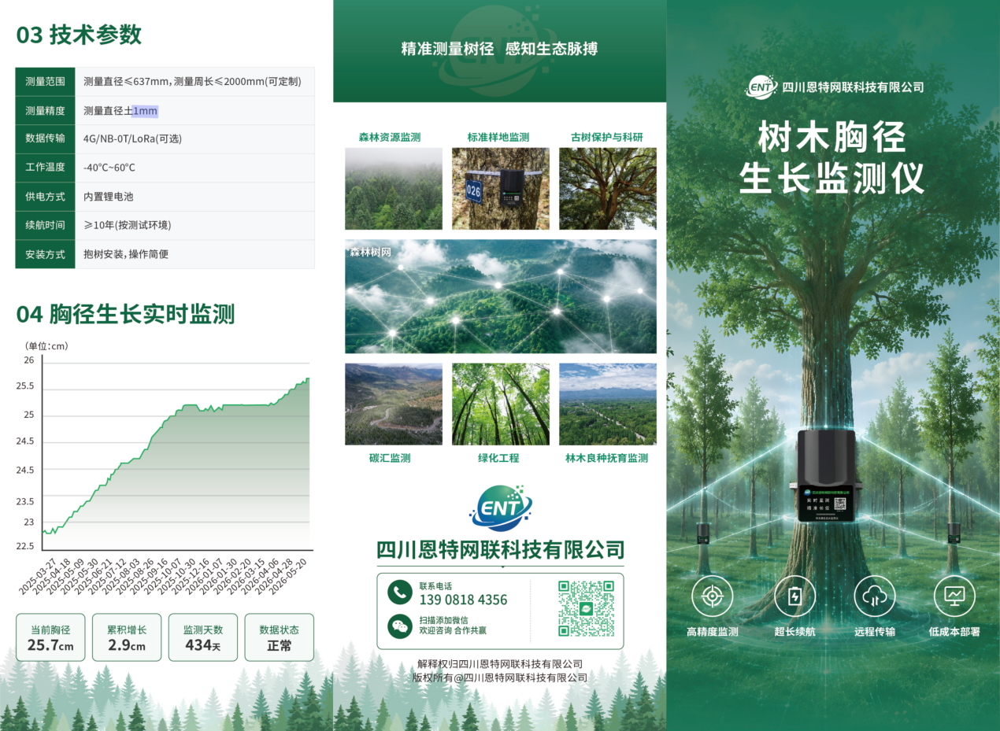

# Product — 树木胸径生长监测仪

> **一次安装，守护十年** —— Industrial-grade DBH (diameter-at-breast-height) growth sensor + cloud platform, the hardware counterpart to this SDK.

This document introduces the **tree-diameter growth monitor** that produces the data accessible through this SDK. If you are integrating the SDK into your own application, the rest of [`docs/`](.) explains the API; this page explains the **thing being measured**.

---

## 目录 / Contents

- [产品概述 / Overview](#产品概述--overview)
- [核心优势 / Key advantages](#核心优势--key-advantages)
- [技术参数 / Specifications](#技术参数--specifications)
- [工作原理 / How it works](#工作原理--how-it-works)
- [典型应用场景 / Use cases](#典型应用场景--use-cases)
- [采购与合作 / Get in touch](#采购与合作--get-in-touch)

---

## 产品概述 / Overview

<table>
<tr>
<td width="60%" valign="top">

### 中文

传统林业外业调查长期依赖"皮尺 + 手写"模式，效率低、误差大、成本高 —— 单株测量耗时超过 5 分钟，肉眼读数 + 笔录误差可达 18%，长期、连续的生长数据根本无法获得。

**树木胸径生长监测仪**通过工业级位移传感器、7×24 自动采集、≥10 年超长续航和 30 秒无损抱箍式安装，将传统人工测量升级为"设备长期记录变化"的数字化监测体系。设备采集的数据通过 4G / NB-IoT / LoRa 接入云端平台，自动生成生长曲线，并支撑碳汇核算、国储林管理、古树名木保护等长期、连续的生态应用。

同等监测任务仅需 1 人 1 天即可完成，数据准确率稳定在 **99.9%**。

</td>
<td width="40%" align="center">



</td>
</tr>
</table>

### English

Traditional forestry field surveys rely on **tape-measure + handwriting** — slow, error-prone, costly. Measuring a single tree takes more than five minutes, and the combined reading + transcription error reaches ~18%. Continuous, long-term growth data is essentially impossible to obtain this way.

The **Tree DBH Growth Monitor** (树木胸径生长监测仪) replaces that workflow with an industrial-grade displacement sensor running 7×24, powered by a 10-year lithium cell, and mounted in 30 seconds via a strap that does not damage the bark. Data flows back over 4G / NB-IoT / LoRa to a cloud platform that automatically renders growth curves and supports carbon-accounting, national-reserve-forest management, and ancient-tree protection applications.

A job that used to take a full field team can now be done by **one person in one day**, with **99.9%** data accuracy.

---

## 核心优势 / Key advantages

| 中文 | English |
| --- | --- |
| **毫米级精度** —— 工业级位移传感器，测量误差 ≤ ±1 mm | **Millimeter accuracy** — industrial-grade displacement sensor, ≤ ±1 mm error |
| **7×24 实时监测** —— 全自动周期性采集与传输 | **7×24 real-time monitoring** — fully automated periodic sampling and upload |
| **≥10 年续航** —— 内置高能量密度电池，无需外接电源 | **≥10-year battery** — internal high-density cell, no external power needed |
| **智能数据管理** —— 自动生成生长曲线、可视化与合规导出 | **Smart data management** — automatic growth curves, visualization, compliance export |
| **30 秒无损安装** —— 抱箍式、<200 g、不打孔不伤树皮 | **30-second non-invasive install** — strap-mounted, <200 g, no drilling, no bark damage |
| **多通信方式** —— 4G / NB-IoT / LoRa 可选 | **Multiple radios** — 4G / NB-IoT / LoRa, selectable |

### 一图看懂 / At a glance


---

## 技术参数 / Specifications

| 参数 / Parameter | 值 / Value |
| --- | --- |
| 测量范围 / Measurement range | 直径 ≤ 637 mm，周长 ≤ 2000 mm（可定制） |
| 测量精度 / Accuracy | **±1 mm** |
| 数据传输 / Connectivity | 4G / NB-IoT / LoRa（可选） |
| 工作温度 / Operating temperature | **-40 ℃ ～ 60 ℃** |
| 供电方式 / Power | 内置锂电池 / Internal lithium cell |
| 设计续航 / Battery life | **≥ 10 年**（依采集频率而定 / depends on sampling rate） |
| 整机重量 / Weight | < 200 g |
| 安装方式 / Mounting | 抱箍式无损安装 / Strap-mounted, non-invasive |
| 单点安装时间 / Install time per unit | ≈ 30 s |

---

## 工作原理 / How it works

```
  ┌──────────┐    ① periodic sampling     ┌──────────┐
  │   Tree   │ ◀──────────────────────── │  Sensor  │
  │ (DBH ±)  │ ────────────────────────▶ │ on trunk │
  └──────────┘    ② displacement          └────┬─────┘
                                               │ ③ radio uplink
                                               ▼
                                        ┌──────────────┐
                                        │ 4G/NB/LoRa   │
                                        │  gateway     │
                                        └────┬─────────┘
                                             │
                                             ▼
                                      ┌──────────────┐
                                      │ Forest Tree  │
                                      │ Net platform │
                                      └────┬─────────┘
                                             │
       ┌─────────────────────────────────────┼─────────────────────────────────────┐
       │                                     │                                     │
       ▼                                     ▼                                     ▼
 ┌───────────┐                       ┌─────────────┐                       ┌─────────────┐
 │ Web dash- │                       │  REST API   │  ◀──── this SDK ────  │  3rd-party   │
 │ board     │                       │  (token)    │                       │  apps        │
 └───────────┘                       └─────────────┘                       └─────────────┘
```

1. **传感器**抱箍固定在树干胸径位置，周期性采集胸径位移。
2. 测量值通过 **4G / NB-IoT / LoRa** 定时或实时上传。
3. 数据进入 **Forest Tree Net 云端平台**，自动存储并生成生长曲线。
4. 平台对外暴露 **REST API** —— 即本仓库 SDK（`forest-tree-net-client`）所封装的那一组接口。
5. 第三方应用通过 SDK 拉取样地、样木、设备、历史读数，构建自有分析、可视化或上报系统。

The sensor is strap-mounted at breast height, samples displacement on a fixed schedule, and pushes the readings over 4G / NB-IoT / LoRa. The platform ingests them, stores them, and renders growth curves. **This SDK is the Java façade over the platform's REST API.**

---

## 典型应用场景 / Use cases

详见 [USE_CASES.md](./USE_CASES.md)。

| 场景 / Scenario | 关注指标 / What matters |
| --- | --- |
| 国有林场资源动态监测 / State forest resource monitoring | DBH growth, sample-plot coverage |
| 国家储备林建设 / National reserve forest management | Long-term volume increment, growth models |
| 森林碳汇监测 / Forest carbon sink monitoring | Continuous DBH increment for biomass / carbon stock estimation |
| 古树名木保护 / Ancient & heritage tree protection | Per-tree long-term health trend |
| 林业样地监测 / Forestry sample-plot monitoring | Research-grade continuous time series |
| 城市绿化与生态工程 / Urban greening | City-tree growth trend |
| 林木倾倒风险预警 / Tree-fall risk early warning | Inclination / tilt data from integrated IMU |

---

## 采购与合作 / Get in touch

- **制造商 / Manufacturer**: 四川恩特网联科技有限公司 (Sichuan Enternet Technology Co., Ltd.)
- **技术支持 / Technical support**: 详见 [../README.md](../README.md)
- **商务联系 / Sales contact**: 139 0818 4356
- **SDK 集成 / SDK integration questions**: 请在本仓库提交 [Issue](https://github.com/<your-org>/BtTreeGauge/issues) 或 [Discussion](https://github.com/<your-org>/BtTreeGauge/discussions)

> The SDK in this repository is **hardware-agnostic** — it works with any sensor that uploads to the Forest Tree Net platform. If you are using the 四川恩特网联 tree-diameter monitor, the API is already wired up and ready to consume.